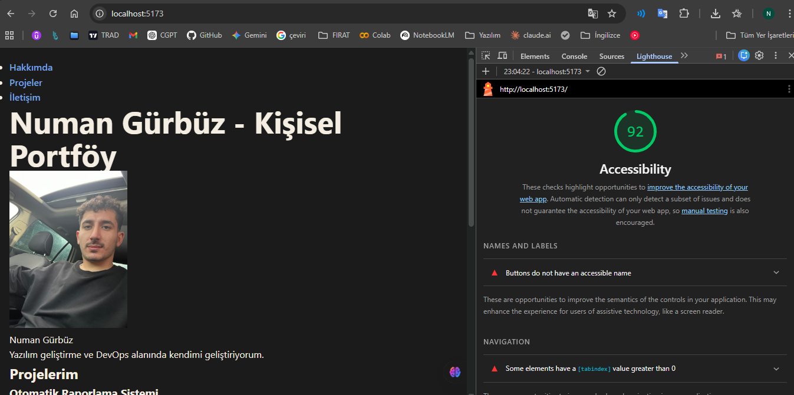

# Web LAB-2 - Kisisel Portfolyo

## Hakkinda
Bu proje, Web Tasarimi ve Programlama dersi LAB-2 kapsaminda Vite + React + TypeScript kullanilarak olusturulmustur. Projede semantik HTML yapisi kurulmus, form dogrulamalari yapilmis ve erisilebilirlik (Lighthouse) standartlari saglanmistir.

## Gelistirici
**Ad Soyad:** Numan Gürbüz  
**Ogrenci No:** 230542012  
**Bolum:** Yazilim Muhendisligi  

## Kullanilan Teknolojiler
- React 18
- TypeScript
- Vite
- Semantik HTML5

## Kurulum

```bash
npm install
```

## Calistirma (Gelistirme)

```bash
npm run dev
```

Tarayicida http://localhost:5173 adresini ac.

## Ekran Goruntuleri
**Lighthouse Erisilebilirlik Skoru (92):**

